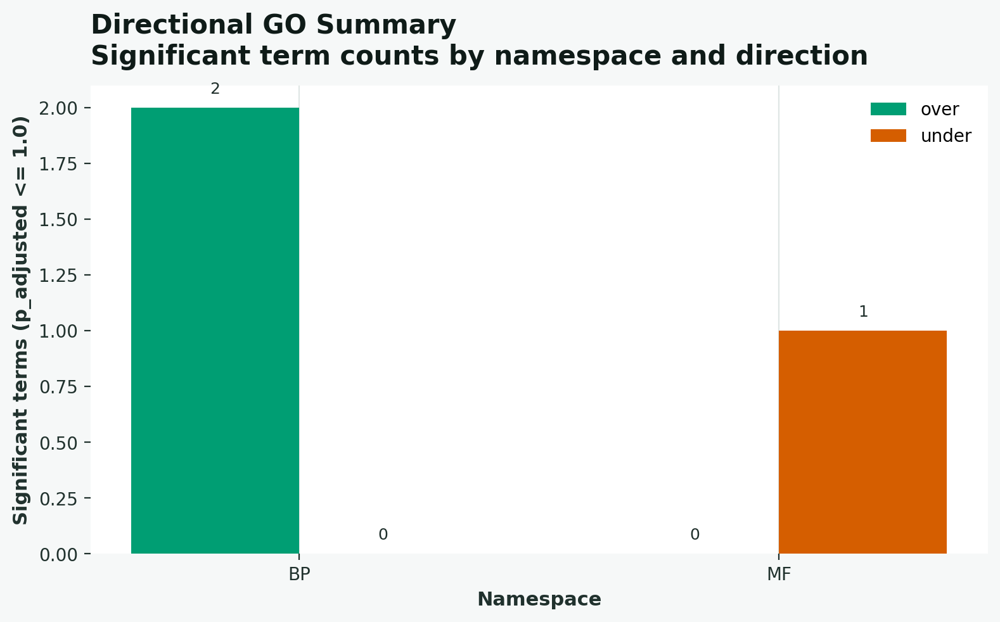

<p align="center">
  <h1 align="center">gokit</h1>
  <p align="center">
    Command-line toolkit for Gene Ontology enrichment analysis.
  </p>
  <p align="center">
    <a href="./docs">Docs</a>
    ·
    <a href="https://github.com/JLSteenwyk/gokit/issues">Report Bug</a>
    ·
    <a href="https://github.com/JLSteenwyk/gokit/issues">Request Feature</a>
  </p>
  <p align="center">
    <a href="https://github.com/JLSteenwyk/gokit/actions/workflows/ci.yml">
      
    </a>
    <a href="https://pypi.org/project/gokit/">
      
    </a>
    <a href="https://lbesson.mit-license.org/">
      
    </a>
  </p>
</p>

---

This README covers quick setup and core usage. For release process details, see [`docs/RELEASE.md`](docs/RELEASE.md).

## Quick Start

```bash
# install
pip install -e .[dev]

# download default ontology files into current directory
gokit download

# optional but recommended input sanity check
gokit validate --study study.txt --population population.txt --assoc assoc.txt

# run enrichment
gokit enrich \
  --study study.txt \
  --population population.txt \
  --assoc assoc.txt \
  --out results/goea

# build a consolidated markdown report
gokit report --run results/goea
```

Defaults that reduce flags:
- `--obo` defaults to `./go-basic.obo`
- `--assoc-format` defaults to `auto`
- `--test-direction` defaults to `both`

## Input File Format

Minimal expected inputs:
- `study.txt`: one study gene ID per line.
- `population.txt`: one background gene ID per line.
- `assoc.txt`: one gene-to-GO mapping per line as `<gene_id><space>GO:NNNNNNN`; multiple GO terms on one line are supported using semicolons (`geneA GO:0008150;GO:0003674`). Tabs are also accepted.

Example:

```text
# study.txt
geneA
geneB

# population.txt
geneA
geneB
geneC
geneD

# assoc.txt
geneA GO:0008150;GO:0003674
geneB GO:0008150
geneC GO:0005575
```

## Installation

We recommend using a virtual environment.

```bash
python -m venv venv
source venv/bin/activate
pip install -e .[dev]
```

To install from source:

```bash
git clone https://github.com/JLSteenwyk/gokit.git
cd gokit
python -m venv venv
source venv/bin/activate
pip install -e .[dev]
```

## Command Status

| Command | Status | What it does |
|---|---|---|
| `gokit enrich` | Supported | Runs GO enrichment (single or batch), writes deterministic outputs, semantic comparisons, optional auto-plot emission, and run manifest. |
| `gokit validate` | Supported | Validates required inputs before enrichment. |
| `gokit plot` | Supported | Generates figures from enrichment tables and semantic similarity matrices. |
| `gokit download` | Supported | Downloads `go-basic.obo` and `goslim_generic.obo` from GO endpoints. |
| `gokit report` | Supported | Generates a consolidated markdown run report. |
| `gokit explain` | Placeholder | Current scaffold only; detailed statistical/ancestor trace explanation is planned. |

Shorthand aliases:
- `gk_enrich`
- `gk_validate`
- `gk_plot`
- `gk_download`
- `gk_report`
- `gk_explain`

## Common Workflows

Single-study enrichment:

```bash
gokit enrich \
  --study study.txt \
  --population population.txt \
  --assoc assoc.txt \
  --out results/goea
```

Batch enrichment + semantic similarity:

```bash
gokit enrich \
  --studies studies.tsv \
  --population population.txt \
  --assoc assoc.txt \
  --assoc-format id2gos \
  --out results_batch \
  --out-formats tsv,jsonl \
  --compare-semantic \
  --semantic-metric wang \
  --semantic-top-k 5 \
  --semantic-namespace all \
  --semantic-min-padjsig 0.05
```

`studies.tsv` accepts either:
- `study_name<TAB>/path/to/study.txt`
- `/path/to/study.txt` (name inferred from filename)

## Plotting Examples

Term-level and direction summary figures:

```bash
gokit plot \
  --input results_batch/all_studies.tsv \
  --study-id study_a \
  --kind term-bar \
  --direction both \
  --top-n 20 \
  --out figures/study_a_terms \
  --format png

gokit plot \
  --input results_batch/all_studies.tsv \
  --study-id study_a \
  --kind direction-summary \
  --alpha 0.05 \
  --out figures/study_a_direction_summary.png
```

Semantic network figure from batch similarity matrix:

```bash
gokit plot \
  --input results_batch/semantic_similarity.tsv \
  --kind semantic-network \
  --min-similarity 0.25 \
  --max-edges 40 \
  --out figures/semantic_network.png
```

Optional auto-plot emission from `enrich`:

```bash
gokit enrich \
  --studies studies.tsv \
  --population population.txt \
  --assoc assoc.txt \
  --out results_batch \
  --compare-semantic \
  --emit-plots term-bar,direction-summary,semantic-network \
  --plot-format png
```

## Example Figures

Term-bar plot generated by `gokit plot --kind term-bar`:


Direction summary plot generated by `gokit plot --kind direction-summary`:



Semantic network plot generated by `gokit plot --kind semantic-network`:


## Supported Analysis Controls

- Association formats: `id2gos`, `gaf`, `gpad`, `gene2go`, `auto`
- Multiple-testing methods (`--method`):
  - `fdr_bh` (default)
  - `fdr_by`
  - `bonferroni`
  - `holm`
  - `none`
- Direction tests (`--test-direction`): `both` (default), `over`, `under`
- Semantic metrics (`--semantic-metric`): `jaccard`, `resnik`, `lin`, `wang`
- ID normalization (`--id-type`): `auto`, `str`, `int`

## Download Command Equivalence

`gokit download` is equivalent to:
- `wget http://current.geneontology.org/ontology/go-basic.obo`
- `wget http://current.geneontology.org/ontology/subsets/goslim_generic.obo`
